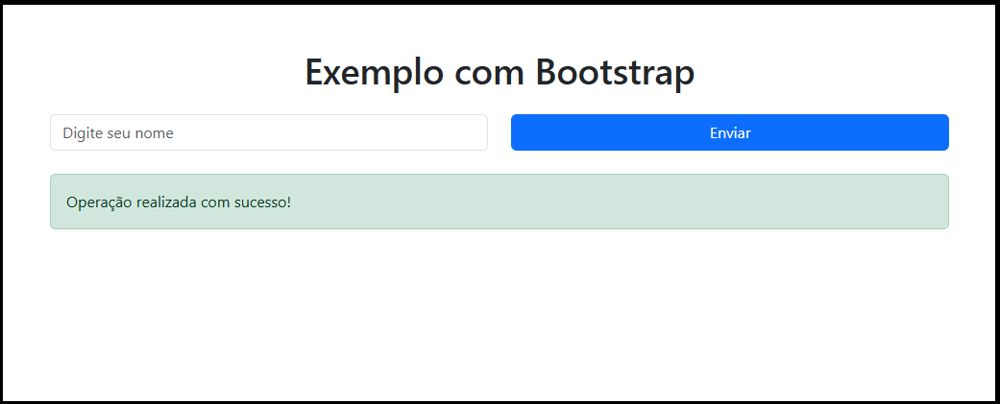

> 💡 **Contexto**  
> Durante o processo de estudo e desenvolvimento do projeto, alguns temas adicionais se destacaram por sua relevância no contexto do desenvolvimento frontend moderno. Esses tópicos, embora não centrais para a implementação do projeto, contribuem significativamente para a produtividade, organização e profissionalização do processo de desenvolvimento.

---

## Bootstrap

O Bootstrap é um framework CSS amplamente utilizado para o desenvolvimento de interfaces web responsivas e padronizadas. Ele fornece um conjunto de componentes prontos, como botões, formulários, grids e elementos de navegação, permitindo a construção rápida de interfaces consistentes.

Entre suas principais características, destacam-se:

- Sistema de grid responsivo  
- Componentes reutilizáveis  
- Estilização padronizada  
- Facilidade de uso  

A utilização do Bootstrap pode acelerar o desenvolvimento, especialmente em fases iniciais de prototipação, permitindo que o foco esteja na funcionalidade da aplicação.

### Exemplo de uso com Bootstrap

A seguir, apresenta-se um exemplo simples de interface utilizando classes do Bootstrap:

```html
<!DOCTYPE html>
<html lang="pt-BR">
<head>
  <meta charset="UTF-8">
  <title>Exemplo Bootstrap</title>
  <link href="https://cdn.jsdelivr.net/npm/bootstrap@5.3.0/dist/css/bootstrap.min.css" rel="stylesheet">
</head>
<body>

  <div class="container mt-5">
    <h1 class="text-center">Exemplo com Bootstrap</h1>

    <div class="row mt-4">
      <div class="col-md-6">
        <input type="text" class="form-control" placeholder="Digite seu nome">
      </div>
      <div class="col-md-6">
        <button class="btn btn-primary w-100">Enviar</button>
      </div>
    </div>

    <div class="alert alert-success mt-4">
      Operação realizada com sucesso!
    </div>
  </div>

</body>
</html>
```

### Resultado Visual


---

> 🟡 **Pontos de Atenção**

No entanto, seu uso também apresenta algumas limitações:

- Interfaces podem se tornar visualmente padronizadas e pouco personalizadas  
- Dependência de classes específicas do framework  
- Possível aumento de código não utilizado  

Apesar disso, o Bootstrap continua sendo uma ferramenta relevante, principalmente para desenvolvimento rápido e criação de protótipos funcionais.

---

## Docker

O Docker é uma plataforma que permite a criação e execução de aplicações em containers, garantindo que o software funcione de maneira consistente em diferentes ambientes.

A principal ideia do Docker é empacotar a aplicação juntamente com suas dependências, evitando problemas relacionados à configuração de ambiente, conhecidos como "funciona na minha máquina".

Entre seus principais benefícios, destacam-se:

- Portabilidade entre ambientes (desenvolvimento, teste e produção)  
- Isolamento de dependências  
- Facilidade de configuração do ambiente  
- Reprodutibilidade do sistema  

No contexto de desenvolvimento frontend, o Docker pode ser utilizado para:

- Padronizar o ambiente de desenvolvimento  
- Executar aplicações em containers  
- Integrar com pipelines de CI/CD  
- Facilitar o deploy da aplicação  

> 🟡 **Pontos de Atenção**

Apesar de suas vantagens, o uso do Docker pode apresentar desafios:

- Curva de aprendizado inicial  
- Configuração de containers e imagens  
- Complexidade adicional em projetos simples  

### Exemplo de Dockerfile

A seguir, apresenta-se um exemplo simples de configuração de um container para uma aplicação frontend:

```dockerfile
# utiliza uma imagem como base, nesse exemplo do Node.js
FROM node:18

# define o diretório de trabalho dentro do container
WORKDIR /app

# copia os arquivos do projeto (da sua máquina para o container)
COPY package*.json ./

# instala as dependências do projeto
RUN npm install

# copia o restante dos arquivos do projeto para o container
COPY . .

# define a porta que a aplicação vai rodar
EXPOSE 3000

# comandos para rodar a aplicação
CMD ["npm", "run", "dev"]
```

Para facilitar a execução, pode-se utilizar o docker-compose:

```yaml
version: '3.8'

services:
  frontend:
    build: .
    ports:
      - "3000:3000"
    volumes:
      - .:/app
      - /app/node_modules
```

O docker-compose permite definir e gerenciar múltiplos containers de forma simplificada, facilitando o desenvolvimento e a integração com outros serviços, como bancos de dados ou APIs. Nesse exemplo, o serviço `frontend` é construído a partir do Dockerfile, mapeando a porta 3000 do container para a porta 3000 da máquina local, e utilizando volumes para sincronizar os arquivos do projeto.

---

## Conclusão

> 🧾 **Síntese**

A exploração de ferramentas como Bootstrap e Docker amplia a visão sobre o desenvolvimento de software, indo além da implementação direta do código.

Enquanto o Bootstrap contribui para a construção rápida e padronizada de interfaces, o Docker oferece soluções robustas para gerenciamento de ambientes e execução de aplicações.

Dessa forma, o estudo desses tópicos complementa a formação do desenvolvedor, proporcionando uma compreensão mais ampla das práticas e ferramentas utilizadas no desenvolvimento moderno.

---

## Referências

- BOOTSTRAP. *Bootstrap Documentation*. Disponível em: `<https://getbootstrap.com/>`. Acesso em: 25 mar. 2026.

- DOCKER. *Docker Documentation*. Disponível em: `<https://docs.docker.com/>`. Acesso em: 25 mar. 2026.

- MERKEL, Dirk. *Docker: Lightweight Linux Containers for Consistent Development and Deployment*. Linux Journal, 2014.