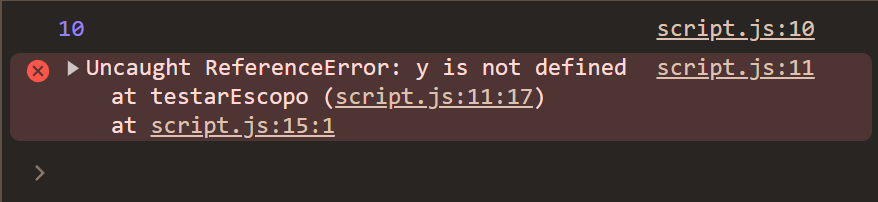
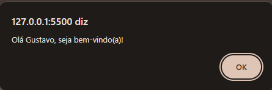
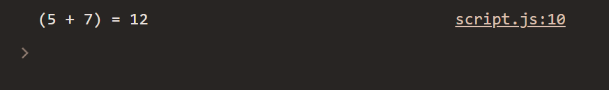
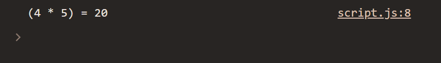
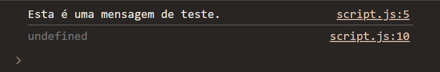
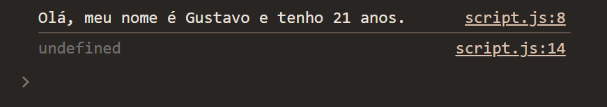
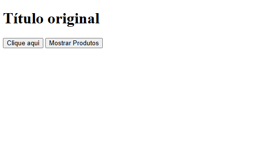
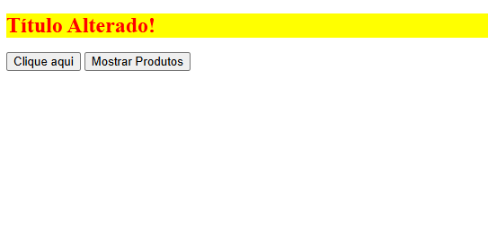

## 1. Introdução

Este relatório documenta o aprendizado adquirido durante o estudo introdutório de JavaScript, abrangendo desde a sintaxe básica da linguagem, passando por funções, classes e manipulação do DOM, até a documentação do código com JSDocs. O objetivo foi construir uma base sólida para futuros desenvolvimentos web interativos.

---
## 2. Sintaxe básica do JavaScript
A sintaxe básica do JavaScript define as regras para escrever programas. É o primeiro passo para entender como a linguagem funciona, incluindo variáveis, tipos de dados, operadores e estruturas de controle. Dominar essa base é essencial, pois todos os conceitos mais avançados dependem dela.

---
### 2.1 Conceitos Estudados
#### Variáveis e escopo

Variáveis são usadas para armazenar dados. O escopo define onde essas variáveis podem ser acessadas no código.

- Declaração de variáveis com `var`, `let` e `const`
- Tipos de dados primitivos
- Operadores aritméticos, de comparação e lógicos
- Estruturas condicionais (`if/else`, `switch`)
- Estruturas de repetição (`for`, `while`)

#### 2.1.1 Código Desenvolvido
```javascript
// Variáveis são usadas para armazenar dados, e o escopo determina onde essas variáveis podem ser acessadas
// var: Escopo global ou de função, pode ser redeclarada e reatribuída
// let e const: Escopo de bloco, não podem ser redeclaradas, let pode ser reatribuída, const não pode ser reatribuída
function testarEscopo(){
    if(true){
        var x = 10; //var tem escopo de função, então x é acessível fora do bloco if
        let y = 20; //let tem escopo de bloco, então y só é acessível dentro do bloco if
        const z = 30; //const tem escopo de bloco, então z só é acessível dentro do bloco if
    }
    console.log(x); //10, var é acessível
    console.log(y); //Erro, let não é acessível
    console.log(z); //Erro, const não é acessível    
}

testarEscopo();
```
##### 📊 Resultados Obtidos


---
### 2.2 Estruturas de controle
As estruturas condicionais (`if`, `else`, `switch`) permitem que o programa tome decisões.  
As estruturas de repetição (`for`, `while`) permitem executar blocos de código várias vezes.

---
#### 2.2.1 Código desenvolvido com estruturas de controle
```javascript
// Exemplo de variáveis e condicional
let idade = 21;
const nome = "Gustavo";
if (idade >= 18) {
    console.log(`${nome} é maior de idade.`);
} else {
    console.log(`${nome} é menor de idade.`);
}
// Exemplo de loop
for (let i = 1; i <= 5; i++) {
    console.log(`Número: ${i}`);
}
```
##### 📊 Resultados Obtidos


---
## 3. Funções, Classes e Interface DOM
### 3.1 Funções
Funções são blocos de código reutilizáveis que executam uma tarefa específica. Elas ajudam a organizar o código, evitar repetição e melhorar a legibilidade.  
  
Existem diferentes formas de declarar funções em JavaScript:  
- Função tradicional  
- Função anônima (expressão)  
- Arrow function
---
#### 3.1.1 Função Tradicional
```javascript
//Declaração de função, >>JEITO TRADICIONAL<<
function saudacao(nome){
    alert("Olá " + nome + ", seja bem-vindo(a)!");
}
console.log(saudacao("Gustavo"));
```
##### 📊 Resultados Obtidos


---
#### 3.1.2 Função Anônima
```javascript
// Expressão de função, armazenada em uma variável
const soma = function(a, b){
    return a + b;
};

const a = 5;
const b = 7;

//Por ser um console.log, o resultado da função será exibido no console, e não em um alerta
console.log(`(${a} + ${b}) = ${soma(a, b)}`); //Template String, ferramenta melhor para mexer com formatação de texto
```
##### 📊 Resultados Obtidos


---
#### 3.1.3 Arrow Function
```javascript
//Declaração de função utilizando Arrow Functions
//A lógica após o "=>" representa o comando que a função irá realizar e retornar
const multiplicacao = (a, b) => a * b;

const a = 4;
const b = 5;

console.log(`(${a} * ${b}) = ${multiplicacao(a, b)}`);
```
##### 📊 Resultados Obtidos


---
### 3.2 Parâmetros e retorno
- **Parâmetros**: valores que a função recebe  
- **Return**: valor que a função devolve
#### 3.2.1 Código Desenvolvido
```javascript
//Parâmetros e retorno
// - Parâmetros são valores que a função recebe
// - return envia um valor de volta, caso não tenha return, retornará undefined
function mostraMensagem(mensagem){
    console.log(mensagem);
    //sem return, a função retorna undefined
}

const resultado = mostraMensagem("Esta é uma mensagem de teste.");

console.log(resultado); //undefined, pois a função não tem return
```
##### 📊 Resultados Obtidos


---
### 3.3 Classes
Classes são modelos para criar objetos. Elas permitem aplicar conceitos de Programação Orientada a Objetos (POO), como:
- Encapsulamento  
- Reutilização  
- Organização do código  
  
Uma classe define:  
- **Propriedades** (dados)  
- **Métodos** (comportamentos)  
  
---

#### 3.3.1 Código Desenvolvido
```javascript
//Classes são modelos para criar objetos, definindo propriedades e métodos
class Pessoa {
    constructor(nome, idade){ //O método constructor é chamado quando uma nova instância da classe é criada, o coração da classe, onde definimos as propriedades iniciais do objeto
        this.nome = nome; //'this' se refere à instância da classe, nesse caso, ao objeto que está sendo criado, então 'this.nome' é a propriedade nome do objeto dentro da classe Pessoa, e 'nome' é o parâmetro passado para o constructor
        this.idade = idade;
    }
    apresentar(){ //Método da classe, que pode ser chamado em instâncias da classe
        console.log(`Olá, meu nome é ${this.nome} e tenho ${this.idade} anos.`);
    }
}

const pessoa1 = new Pessoa("Gustavo", 21); //Criando uma nova instância da classe Pessoa, passando os parâmetros(nome, idade)

console.log(pessoa1.apresentar()); //Chamando o método apresentar da instância pessoa1, que irá exibir a mensagem de apresentação no console
```
##### 📊 Resultados Obtidos


---
### 3.4 Classe com Manipulação do DOM
O que é o DOM?  
  
O DOM (Document Object Model) é uma representação em forma de árvore da estrutura HTML de uma página.  
  
Ele permite que o JavaScript:  
- Acesse elementos  
- Modifique conteúdos  
- Altere estilos  
- Crie ou remova elementos  
  
---
#### 3.4.1 Código HTML
```html
<!DOCTYPE html>
<html>
<head>
    <title>Estudo JS</title>
</head>
<body>
    <h1 id="titulo">Título Original</h1>
    <button onclick="mudarTitulo()">Mudar Título</button>
    <button onclick="listarProdutos()">Listar Produtos</button>
    <div id="produtos"></div>
    <script src="script.js"></script>
</body>
</html>
```
#### 3.4.2 Código JavaScript - Mudar o Título
```javascript
//DOM (Document Object Model) é a estrutura de objetos que representa a página web, permitindo a manipulação de elementos HTML e CSS através do JavaScript
//Selecionando elementos do DOM
function mudarTitulo(){
    const titulo = document.getElementById("titulo"); //Seleciona o elemento com id "titulo" e armazena na variável titulo
    titulo.textContent = "Título Alterado!"; //Altera o texto do elemento selecionado para o novo valor/string
    titulo.style.color = "red"; //Altera a cor do texto do elemento selecionado
    titulo.style.fontSize = "24px"; //Altera o tamanho da fonte do texto do elemento selecionado
    titulo.style.backgroundColor = "yellow"; //Altera a cor de fundo do elemento selecionado
}
```

### 3.5 Manipulação Dinâmica  
  
A manipulação do DOM permite criar interfaces dinâmicas, reagindo às ações do usuário, como cliques e interações.
#### 3.5.1 Código JavaScript - Listar Produtos
```javascript
//Criar uma classe Produto e exibir na tela um produto com nome e preço, utilizando manipulação de DOM
class Produto {
    //Construtor da classe, onde definimos as propriedades iniciais do objeto, nesse caso, nome e preço
    constructor(nome, preco) {
        this.nome = nome;
        this.preco = preco;
    }
    //Método para retornar a descrição do produto, .toFixed(2) é usado para formatar o preço com 2 casas decimais
    descricao() {
        return `${this.nome} - R$ ${this.preco.toFixed(2)}`;
    }
}

function listarProdutos() {
    //Instanciando produtos com a classe Produto, passando os parâmetros nome e preço para o constructor
    const p1 = new Produto("Notebook", 3500.00);
    const p2 = new Produto("Mouse", 150.00);
    const p3 = new Produto("Teclado", 200.00);
    //Criação da lista dos produtos que foram instanciados, para facilitar a manipulação e exibição dos produtos no DOM, sem ter que fazer isso individualmente para cada produto
    const lista = [p1, p2, p3];
    //Selecionando o elemento do DOM onde os produtos serão exibidos, nesse caso, um div com id "produtos"
    const div = document.getElementById("produtos");
    //O método .innerHTML é usado para limpar o conteúdo do elemento selecionado, garantindo que a lista de produtos seja exibida corretamente, sem acumular produtos anteriores caso a função seja chamada mais de uma vez
    div.innerHTML = "";
    //Criação da lista de produtos utilizando o método forEach, que percorre cada produto na lista e cria um parágrafo para cada um, exibindo a descrição do produto utilizando o método descricao() da classe Produto, e adicionando esse parágrafo ao elemento div selecionado no DOM
    lista.forEach(produto => {
        const paragrafo = document.createElement("p"); //.createElement é usado para criar um novo elemento HTML, passado como parâmetro, nesse caso, um parágrafo "p"
        paragrafo.textContent = produto.descricao(); //.textContent é usado para definir o texto do elemento criado, nesse caso, a descrição do produto retornada pelo método descricao() da classe Produto
        div.appendChild(paragrafo); //.appendChild é usado para adicionar o elemento criado como filho do elemento selecionado no DOM, nesse caso, adicionando o parágrafo com a descrição do produto dentro do div com id "produtos"
    });
}
```
##### Tela antes de clicar nos botões


---
##### Tela após clicar em "Clique aqui"


---
##### Tela após clicar em "Mostrar Produtos"


---
## 4. Documentação com JSDoc
O JSDoc é uma ferramenta que permite documentar código JavaScript de forma padronizada.  
  
Ele ajuda a:  
- Explicar o funcionamento do código  
- Melhorar a legibilidade  
- Auxiliar outras pessoas (ou você no futuro)  
  
---
### 4.1 Conceitos Aplicados
- Uso de comentários de linha `(//)` e bloco `(/* ... */`
- Documentação profissional com base em JSDoc
### 4.2 Exemplo de código documentado
```javascript
/**
 * Calcula o valor com desconto aplicado
 * @class Produto
 */
class Produto {
    /**
     * Cria um novo produto
     * @param {string} nome - Nome do produto
     * @param {number} preco - Preço original
     */
    constructor(nome, preco) {
        this.nome = nome;
        this.preco = preco;
    }

    /**
     * Aplica um percentual de desconto
     * @param {number} percentual - Desconto (0-100)
     * @returns {number} Preço com desconto
     * @throws {Error} Se percentual for inválido
     * @example
     * const p = new Produto("Mouse", 100);
     * p.aplicarDesconto(10); // retorna 90
     */
    aplicarDesconto(percentual) {
        if (percentual < 0 || percentual > 100) {
            throw new Error("Percentual inválido");
        }
        return this.preco * (1 - percentual / 100);
    }
}
```

### 4.3 Benefícios Observados
- **VS Code:** Ao digitar `Produto` ou ao passar o mouse sobre, a IDE mostra a documentação antes escrita.
- **Clareza:** Outros desenvolvedores entendem o código sem precisar ler a implementação do mesmo.
- **Manutenibilidade:** Facilita atualizações futuras no código.
#### 4.3.1 Documentação da Classe `Produto`
![[documentacaoProduto.png]]
#### 4.3.2 Documentação do `Construtor` da Classe `Produto`
![[documentacaoConstrutorProduto.png]]
#### 4.3.3 Documentação do método `descricao()` da Classe `Produto`
![[documentacaoMetodoProduto.png]]

## 5. Requisições HTTP

### 5.1 Introdução
Requisições HTTP são a base da comunicação entre o frontend (navegador) e o backend (servidores). 

Elas permitem:  
- Buscar dados  
- Enviar informações  
- Atualizar conteúdos  
- Remover registros  
  
---
### 5.2 O que é uma API?
API (Application Programming Interface) é um conjunto de regras que permite que diferentes softwares se comuniquem. No contexto web, as APIs expõem **endpoints** (URLs) que retornam dados, geralmente no formato **JSON**.

---
### 5.3 Métodos HTTP
| Método     | Descrição                   | Exemplo de uso           |
| ---------- | --------------------------- | ------------------------ |
| **GET**    | Buscar/ler dados            | Listar usuários          |
| **POST**   | Criar novo recurso          | Cadastrar novo usuário   |
| **PUT**    | Atualizar recurso existente | Editar perfil completo   |
| **PATCH**  | Atualizar parcialmente      | Modificar apenas o email |
| **DELETE** | Remover recurso             | Excluir um usuário       |

---
### 5.4 Códigos de status HTTP

| Código  | Categoria        | Significado                                         |
| ------- | ---------------- | --------------------------------------------------- |
| 200-299 | Sucesso          | Requisição bem-sucedida                             |
| 300-399 | Redirecionamento | Recurso movido                                      |
| 400-499 | Erro do cliente  | Requisição inválida, não autorizado, não encontrado |
| 500-599 | Erro do servidor | Falha interna no backend                            |

---
### 5.5 Exemplos de requisições
#### 5.5.1 GET - Buscar dados
```javascript
async function buscarRecursos() {
    const resposta = await fetch('https://api.exemplo.com/recursos');
    const recursos = await resposta.json();
    return recursos;
}
```

#### 5.5.2 POST - Criar dados
```javascript
async function criarRecurso(dados) {
    const resposta = await fetch('https://api.exemplo.com/recursos', {
        method: 'POST',
        headers: {
            'Content-Type': 'application/json'
        },
        body: JSON.stringify(dados)
    });
    
    const novoRecurso = await resposta.json();
    return novoRecurso;
}
```

#### 5.5.3 PUT/PATCH - Atualizar dados
```javascript
async function atualizarRecurso(id, dadosAtualizados) {
    const resposta = await fetch(`https://api.exemplo.com/recursos/${id}`, {
        method: 'PUT', // ou PATCH
        headers: {
            'Content-Type': 'application/json'
        },
        body: JSON.stringify(dadosAtualizados)
    });
    
    const recursoAtualizado = await resposta.json();
    return recursoAtualizado;
}
```

#### 5.5.4 DELETE - Remover dados
```javascript
async function deletarRecurso(id) {
    const resposta = await fetch(`https://api.exemplo.com/recursos/${id}`, {
        method: 'DELETE'
    });
    
    if (resposta.ok) {
        console.log('Recurso deletado com sucesso');
    }
}
```

---
### 5.6 Tratamento de erro
É essencial tratar erros para evitar falhas inesperadas e melhorar a experiência do usuário.
```javascript
async function buscarComSeguranca() {
    try {
        const resposta = await fetch('https://api.exemplo.com/recursos');
        
        //verifica se a requisição foi bem-sucedida
        if (!resposta.ok) {
            throw new Error(`Erro HTTP: ${resposta.status}`);
        }
        
        const dados = await resposta.json();
        return dados;
        
    } catch (erro) { //caso ocorra algum erro durante a requisição, exibe o erro
        console.error('Falha na requisição:', erro.message);
        return null;
    }
}
```

---
### 5.7 Headers e autenticação
Headers podem conter informações importantes, como tokens de autenticação, garantindo segurança na comunicação.
```javascript
//requisição com token de autenticação sendo passado como parâmetro para validar a permissão (autorização)
async function buscarDadosProtegidos(token) {
    const resposta = await fetch('https://api.exemplo.com/dados-protegidos', {
        headers: {
            'Authorization': `Bearer ${token}`,
            'Content-Type': 'application/json'
        }
    });
    
    return await resposta.json();
}
```

----
## 6. Manipulação de Interface (DOM)
O **DOM (Document Object Model)** é a representação em árvore de todos os elementos de uma página HTML. O DOM transforma cada tag HTML em um **objeto** que pode ser manipulado via JavaScript. 
Ela permite:  
- Criar interfaces dinâmicas  
- Atualizar conteúdos em tempo real  
- Interagir com o usuário

```
Estrutura da árvore do DOM

document (raiz)
  ├── html
  │   ├── head
  │   │   ├── title
  │   │   └── meta
  │   └── body
  │   .   ├── header
  │   .   ├── main
  │   .   └── footer
  .   .
  .   .
  .   .
```

---
### 6.1 Selecionando elementos
A seleção de elementos é o primeiro passo para manipular o DOM. Antes de alterar qualquer conteúdo ou estilo, é necessário obter uma referência ao elemento desejado dentro da página.  
  
O JavaScript oferece diferentes métodos para selecionar elementos, cada um com suas características específicas:  
  
- Métodos por ID são mais diretos e retornam apenas um elemento.  
- Métodos por classe e tag retornam coleções de elementos.  
- Seletores CSS (`querySelector` e `querySelectorAll`) oferecem maior flexibilidade e são amplamente utilizados em aplicações modernas.  
  
A escolha do método depende do contexto e da necessidade de manipulação.****
```javascript
// por ID (mais específico)
const elemento = document.getElementById('meu-id');

// por classe (retorna lista)
const elementos = document.getElementsByClassName('minha-classe');

// por tag (retorna lista)
const paragrafos = document.getElementsByTagName('p');

// seletor do CSS (retorna o primeiro)
const primeiro = document.querySelector('.classe');

// seletor do CSS (retorna todos)
const todos = document.querySelectorAll('.classe');
```

---
### 6.2 Manipulando o conteúdo do elemento
Após selecionar um elemento, é possível alterar seu conteúdo de diferentes formas. Essa manipulação permite atualizar dinamicamente as informações exibidas na página.  
  
O conteúdo pode ser alterado como texto simples ou como HTML:  
  
- `textContent` altera apenas o texto do elemento, sendo mais seguro e recomendado na maioria dos casos.  
- `innerHTML` permite inserir código HTML dentro do elemento, possibilitando maior flexibilidade na construção da interface.  
  
Essa capacidade é essencial para criar aplicações dinâmicas, como listas, mensagens interativas e atualizações em tempo real.
```javascript
// alterar apenas o texto 
elemento.textContent = 'Novo texto';
// alterar o HTML por inteiro (daquele elemento, não o arquivo.html todo)
// no .innerHTML é permitido adicionar novas tags dentro do elemento
elemento.innerHTML = '<strong>Texto em negrito</strong>';
// alterar o valor de input
input.value = 'Novo valor';
```

---
### 6.3 Manipulando o estilo do elemento
A manipulação de estilos permite alterar a aparência visual dos elementos diretamente via JavaScript.  
  
Isso pode ser feito utilizando a propriedade `style`, que permite modificar atributos como cor, tamanho, espaçamento e visibilidade.  
  
Embora seja possível aplicar estilos diretamente no elemento (inline), em aplicações maiores é mais recomendado utilizar classes CSS e manipulá-las via JavaScript, garantindo melhor organização e reutilização do código.  
  
Essa abordagem é amplamente utilizada para criar efeitos visuais dinâmicos, como animações, destaque de elementos e feedback ao usuário.
```javascript
// alterando estilos inline, direto no elemento
elemento.style.color = 'red';
elemento.style.backgroundColor = 'blue';
elemento.style.fontSize = '20px';
elemento.style.display = 'none'; 

// adicionando e removendo classes pelo DOM
elemento.classList.add('destaque');
elemento.classList.remove('inativo');
elemento.classList.toggle('visivel'); 
```

---
### 6.4 Criando e removendo elementos
Além de modificar elementos existentes, o JavaScript também permite criar novos elementos e removê-los dinamicamente do DOM.

A criação de elementos é feita através de métodos como `createElement`, enquanto a inserção na página pode ser realizada com `appendChild`, `insertBefore` ou métodos similares.

Da mesma forma, elementos podem ser removidos ou substituídos, permitindo total controle sobre a estrutura da página.

Essa funcionalidade é fundamental para aplicações interativas, como listas dinâmicas, sistemas de comentários e interfaces que se atualizam sem recarregar a página.
```javascript
// cria um novo elemento
const novoParagrafo = document.createElement('p');
novoParagrafo.textContent = 'Texto do parágrafo';

// adiciona ao DOM
const container = document.getElementById('container');
container.appendChild(novoParagrafo);

// insere em uma posição específica
container.insertBefore(novoParagrafo, container.firstChild);

// remove o elemento
const elementoRemover = document.getElementById('remover');
elementoRemover.remove();

// substitui o elemento
const novo = document.createElement('div');
container.replaceChild(novo, elementoAntigo);
```

---
### 6.5 Eventos
Eventos representam as interações do usuário com a página, como cliques, digitação, movimentação do mouse e envio de formulários.

O JavaScript permite capturar esses eventos e executar ações específicas em resposta a eles, por meio do método `addEventListener`.

Essa abordagem possibilita criar interfaces reativas, onde o comportamento da aplicação muda conforme a interação do usuário.

O uso correto de eventos é essencial para melhorar a experiência do usuário e tornar a aplicação mais intuitiva e dinâmica.
```javascript
// Eventos seriam as interações com o usuários

// evento de clique em um botão
botao.addEventListener('click', function() {
    console.log('Botão clicado!');
});

// evento de pressionar uma tecla
input.addEventListener('keyup', function(event) {
    console.log('Tecla pressionada:', event.key);
});
// evento de preencher um formulário da página
formulario.addEventListener('submit', function(event) {
    event.preventDefault(); 
    console.log('Formulário enviado');
});
// evento de interação com o ponteiro do mouse
elemento.addEventListener('mouseenter', () => { //mouse sob o elemento
    elemento.style.backgroundColor = 'yellow'; //deixa o fundo amarelo
});
elemento.addEventListener('mouseleave', () => { //quando o mouse saí do elemento
    elemento.style.backgroundColor = 'white'; //o fundo fica branco
});
```

A manipulação do DOM através do JavaScript é uma das habilidades mais fundamentais para o desenvolvimento web moderno, pois permite transformar páginas estáticas em experiências dinâmicas e interativas. Cada um desses conceitos representa um pilar fundamental que já nos permite construir interfaces interativas como listas dinâmicas, elementos que aparecem e desaparecem conforme a ação do usuário, validação de formulários com feedback visual imediato, além de componentes como menus, abas e modais. Dominar os fundamentos da manipulação do DOM é, portanto, o primeiro passo para explorar todo esse ecossistema de possibilidades que o JavaScript oferece para criar experiências web cada vez mais ricas e sofisticadas.

---
## 7. Conslusão

Ao longo deste estudo, consegui construir uma base sólida em JavaScript, abrangendo desde os conceitos mais fundamentais da linguagem até aplicações práticas no desenvolvimento frontend.

Inicialmente, a compreensão da sintaxe básica me permitiu entender como a linguagem se comporta, principalmente em relação ao escopo de variáveis, estruturas de controle e manipulação de dados. Esses fundamentos foram essenciais para o avanço nos tópicos seguintes.

O estudo de funções e classes contribuiu para a organização do código e introduziu conceitos importantes da Programação Orientada a Objetos, como encapsulamento e reutilização. A aplicação desses conceitos tornou o desenvolvimento mais estruturado e legível.

A manipulação do DOM representou um dos pontos centrais do aprendizado, permitindo transformar páginas estáticas em interfaces dinâmicas e interativas. A capacidade de criar, modificar e reagir a elementos da interface mostrou, na prática, o poder do JavaScript no desenvolvimento web.

Além disso, tive um primeiro contato com requisições HTTP e APIs, me possibilitando entender como aplicações frontend se comunicam com serviços externos, ampliando as possibilidades de desenvolvimento para além do ambiente local.

A utilização de boas práticas, como a documentação com JSDoc, reforçou a importância de escrever código claro, organizado e compreensível, tanto para outros desenvolvedores quanto para futuras manutenções.

De forma geral, este estudo não apenas consolidou meus conhecimentos técnicos, mas também contribuiu para o desenvolvimento de uma visão mais estruturada sobre o funcionamento de aplicações web modernas. Os conceitos aprendidos servem como base para o aprofundamento em frameworks, bibliotecas e arquiteturas mais avançadas no ecossistema JavaScript.

Por fim, este trabalho representa um passo importante na minha jornada de aprendizado em desenvolvimento frontend, estabelecendo fundamentos essenciais para a evolução contínua na área.